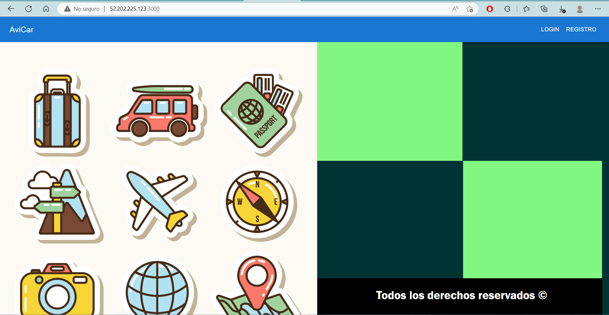
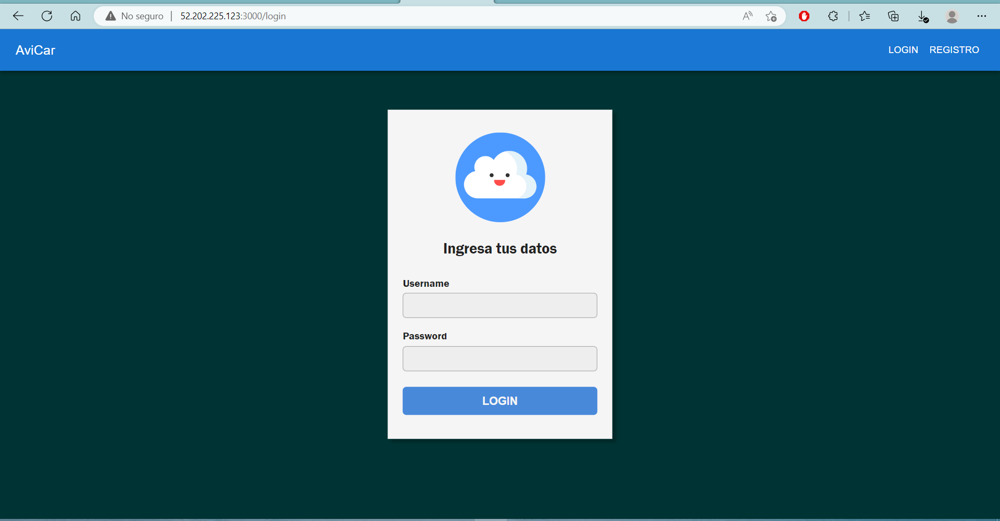
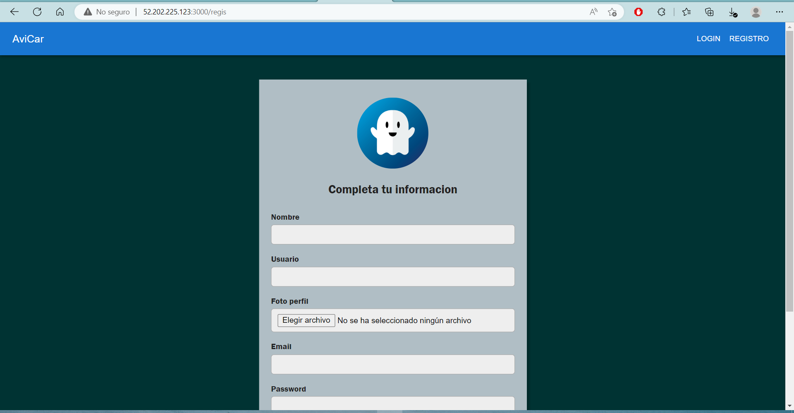
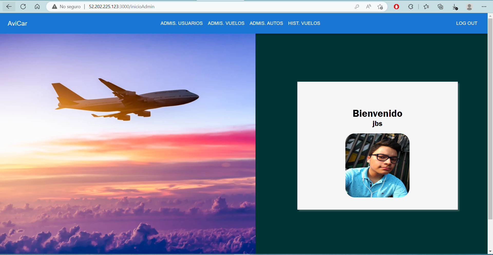
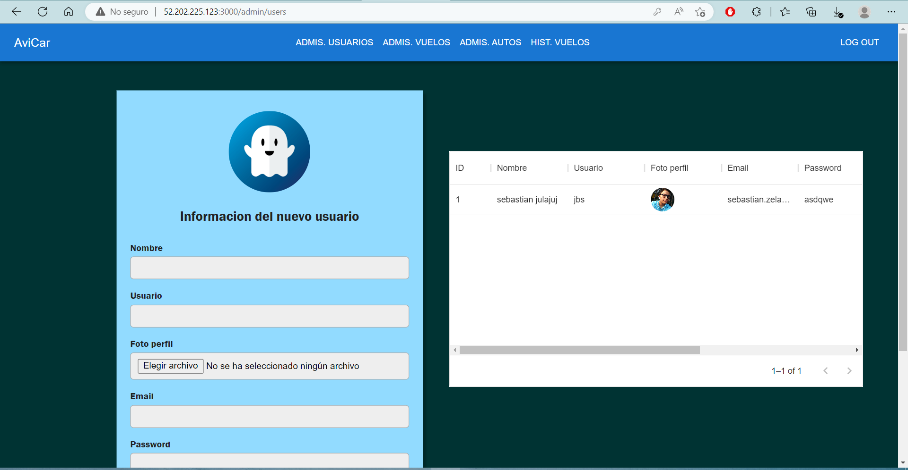
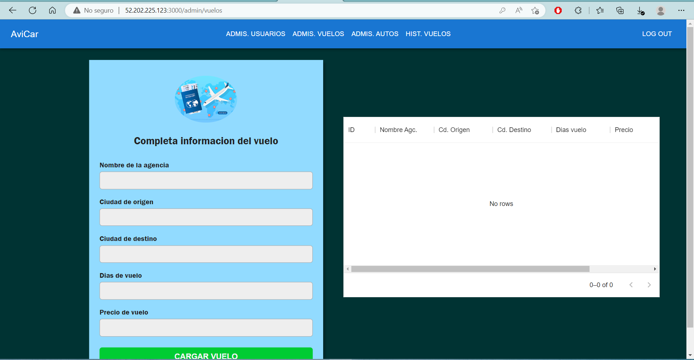
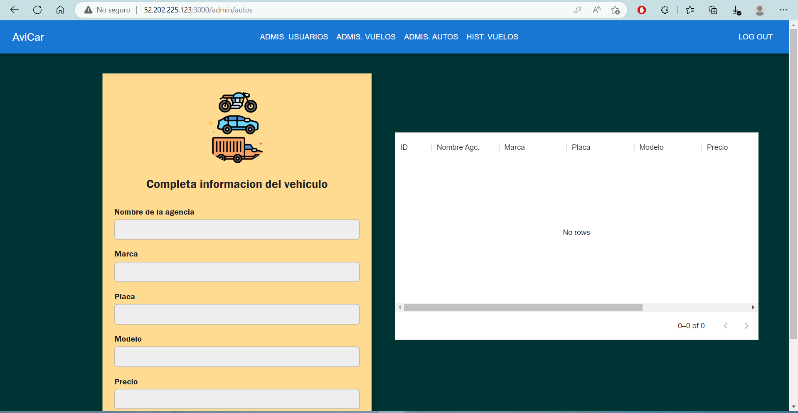
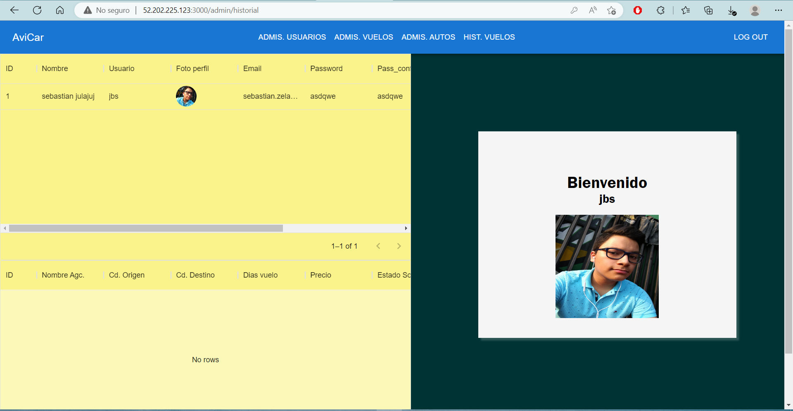
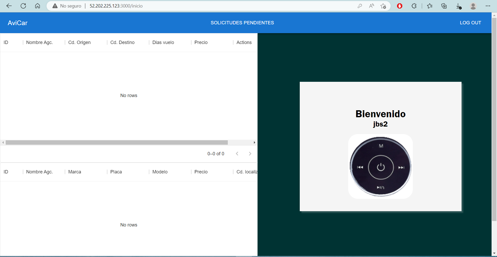
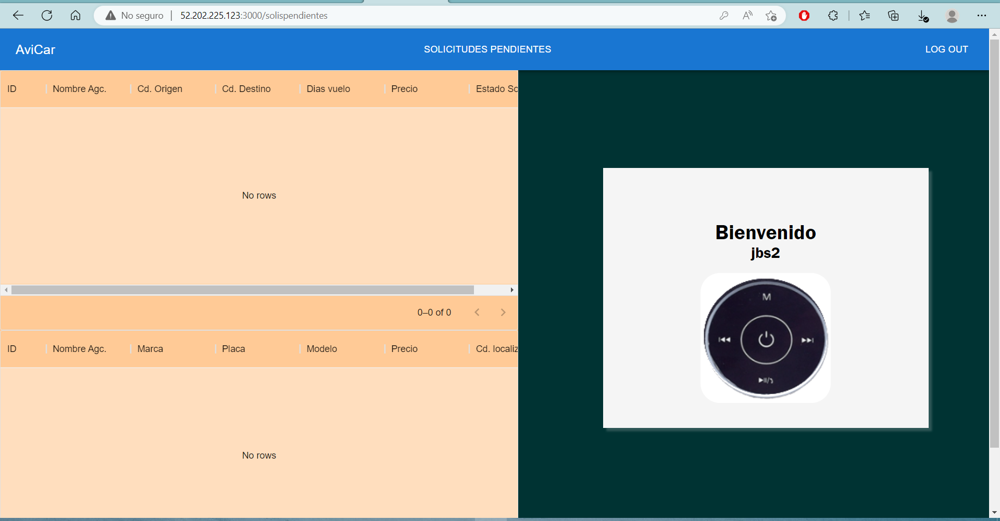

# Proyecto 2 - Manejo e Implementación de Archivos 1 - DIC2022 - Manual de Usuario
## Descripción General
“AviCar” es el sistema que se desarrolló para el gestionamiento de viajes de todo turista 
alrededor del mundo; con el fin de garantizar una completa y agradable experiencia en época 
de post pandemia. La finalidad es centralizar los datos y que el cliente haga la menor 
cantidad de validaciones al momento de planificar su viaje.

## Objetivos
* Administrar los usuarios y permisos por medio de grupos
* Restringir y administrar el acceso a los archivos de modo administrador, cliente y recepcionista.
* Crear una aplicación visual

## Usuarios
* Usuario Turista: Toda persona que desea hacer un viaje a cualquier parte del mundo, 
puede visualizar todos los vuelos en la página de inicio y si desea; realizar la reservación 
de un boleto de avión, así como, el alquiler de un automóvil al momento de llegar a su 
destino.
* Usuario Recepcionista: Este usuario será el encargado de aprobar o rechazar la 
solicitud de vuelo y renta del automóvil de los usuarios que lo soliciten. (Este tipo de 
usuario únicamente podrá aceptar o rechazar las solicitudes de los usuarios turistas).
* Usuario Administrador: Este usuario será el único usuario que podrá agregar o 
eliminar usuarios turista o recepcionista, podrá revisar el historial de vuelos de cada 
usuario turista y agregar o eliminar viajes y automóviles.

## Uso de la aplicacion

En la pagina de inicio de la aplicacion WEB, nos encontramos con dos botones, LOGIN y REGISTRO.

Dando click en el boton de registro, nos redirecciona a una vista donde podemos ingresar nuestros datos y tambien seleccionando si el usuario gozara con
permisos de administrador

Una vez registrados, iniciamos sesion en la pagina del login, para encontar la vista principal del administrador (siempre y cuando sea user administrador)

Posteriormente, podemos ir navegando en las vistas de cada opcion permitida siendo administrador, tanto como eliminar y crear usuarios, eliminar y crear viajes, eliminar y crear 
autos y por ultimo ver el historial de viajes de cada usuario

Luego iniciando sesion como usuario turista, podemos reservar nuestros vuelos o autos y posteriormente ver el estado de la solicitud

Por ultimo como usuario recepcionista, podemos ver las solicitudes y decidir si aceptarlas o denegarlas

